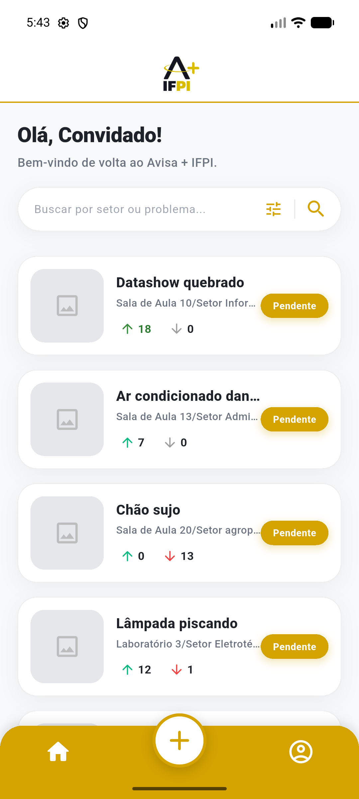

# 📢 Avisa Mais (A+ IFPI)

<p align="center">
  
</p>

<p align="center">
  <strong>Plataforma colaborativa para reporte, acompanhamento e priorização de demandas e manutenções do campus.</strong>
</p>

<p align="center">
  
  
  
  
</p>

---

## 📱 Visão Geral

O **Avisa Mais (A+ IFPI)** é uma solução mobile desenvolvida em Flutter criada para aproximar a comunidade acadêmica (alunos, professores e servidores) da equipe de infraestrutura e gestão.

Com o aplicativo, qualquer usuário pode registrar problemas de infraestrutura ou demandas (como equipamentos quebrados, salas sem climatização, iluminação e limpeza), acompanhar o status em tempo real e apoiar relatos de outros membros através de votação comunitária.

<p align="center">
  
</p>

---

## ✨ Funcionalidades

- **📢 Registro de Demandas:** Cadastro de ocorrências detalhando problema, setor/sala e descrição.
- **🗳️ Votação Colaborativa:** Sistema de *upvotes* e *downvotes* para priorizar os chamados mais urgentes.
- **📊 Status em Tempo Real:** Visualização do ciclo de vida dos chamados (`Pendente`, `Em andamento`, `Resolvido`).
- **💬 Interação Comunitária:** Comentários e discussões em cada chamado reportado.
- **🔍 Busca e Filtros Dinâmicos:** Localize ocorrências por palavras-chave, setor ou status.
- **🔐 Autenticação Completa:** Fluxos de Login, Cadastro com verificação OTP (código de 4 dígitos) e Recuperação de Senha.
- **🎨 Design Moderno & Responsivo:** Interface construída com Material Design 3 e paleta de cores temática.

---

## 🛠️ Tecnologias Utilizadas

- **[Flutter](https://flutter.dev/)** – Framework cross-platform
- **[Dart](https://dart.dev/)** – Linguagem de desenvolvimento
- **Material 3 Design** – Componentes visuais padronizados
- **Arquitetura MVVM / Repository Pattern** – Código modular, escalável e desacoplado

---

## 📂 Estrutura do Projeto

```text
lib/
├── data/
│   ├── models/            # Modelos de dados (Issue, User, Comment)
│   └── repositories/      # Repositórios e fontes de dados mockadas/API
├── routes/                # Gerenciamento de rotas nomeadas
├── screens/               # Telas da aplicação (Home, Login, Detalhes, etc.)
├── theme/                 # Paleta de cores, tipografia e estilos globais
├── viewmodels/            # Gerenciamento de estado e regras de apresentação
├── widgets/               # Componentes reutilizáveis (botões, cards, headers)
└── main.dart              # Ponto de entrada da aplicação
```

---

## 🚀 Como Baixar e Executar no Seu Computador

Siga o passo a passo abaixo para rodar o projeto localmente:

### 1. Pré-requisitos

Antes de começar, certifique-se de ter instalado no computador:

1. **[Git](https://git-scm.com/downloads)**
2. **[Flutter SDK](https://docs.flutter.dev/get-started/install)** (versão 3.13 ou superior)
3. Um editor de código, como **[VS Code](https://code.visualstudio.com/)** ou **[Android Studio](https://developer.android.com/studio)**
4. Dependências de ambiente:
   - Para rodar no Android: **Android Studio** com emulador ou aparelho físico conectado via depuração USB.
   - Para rodar no Navegador: **Google Chrome** instalado.
   - Para rodar no Windows Desktop: Visual Studio com ferramentas C++ para Desktop.

> 💡 **Verifique seu ambiente:** Abra o terminal e execute:
> ```bash
> flutter doctor
> ```
> O comando mostrará se há alguma dependência pendente.

---

### 2. Clonando o Repositório

Abra o terminal (Prompt de Comando, PowerShell ou Terminal do Linux/macOS) e clone o projeto:

```bash
git clone https://github.com/KaykyTFF/Avisa-Mais.git
```

Acesse a pasta do projeto:

```bash
cd Avisa-Mais
```

---

### 3. Instalando as Dependências

Baixe os pacotes e dependências necessários do Flutter:

```bash
flutter pub get
```

---

### 4. Executando o Aplicativo

Para visualizar quais dispositivos ou emuladores estão disponíveis:

```bash
flutter devices
```

Escolha uma das opções para executar:

#### Opção A: No Emulador ou Celular Conectado
Inicie o emulador (ou conecte seu smartphone com depuração USB ativada) e execute:
```bash
flutter run
```

#### Opção B: No Navegador (Chrome)
Para testar rapidamente na web:
```bash
flutter run -d chrome
```

#### Opção C: No Windows (Desktop)
Caso tenha o suporte a Windows Desktop habilitado:
```bash
flutter run -d windows
```

---

## 🔧 Dicas e Resolução de Problemas

- **Limpar cache e reconstruir:**
  Se encontrar qualquer problema de compilação ou assets desatualizados, execute:
  ```bash
  flutter clean
  flutter pub get
  flutter run
  ```

- **Erro de emulador não detectado:**
  Inicie o emulador previamente pelo Android Studio ou use `flutter emulators --launch <nome_do_emulador>`.

---

## 🤝 Contribuição

Contribuições são super bem-vindas!
1. Faça um Fork do projeto (`https://github.com/KaykyTFF/Avisa-Mais/fork`)
2. Crie uma branch para sua funcionalidade (`git checkout -b feature/MinhaFeature`)
3. Faça commit das suas alterações (`git commit -m 'Adiciona MinhaFeature'`)
4. Faça push para a branch (`git push origin feature/MinhaFeature`)
5. Abra um **Pull Request**

---

## 👤 Autor

Desenvolvido por **[KaykyTFF](https://github.com/KaykyTFF)**.  
Projeto institucional para o ecossistema do **IFPI**.
